# Database Design

Olive & Ivory Gifts — Cloudflare D1 (SQLite) schema.
Tables are created either via numbered migrations in `olive_and_ivory_api/migrations/` or
via inline `CREATE TABLE IF NOT EXISTS` guards in `coreRoutes.ts` on first use.

---

## Domain Overview

| Domain | Tables |
|---|---|
| **Catalogue** | `collections`, `gifts`, `collection_gifts` |
| **Gift Components** | `gift_items`, `gift_media`, `items`, `inventory_adjustments` |
| **Variants (legacy)** | `collection_variants`, `collection_variant_items` |
| **Storefront** | `hero_slides`, `featured_collections`, `newsletter_signups`, `settings`, `delivery_zones` |
| **Commerce** | `orders`, `order_items` |
| **AI** | `ai_prompts`, `gift_ai_runs` |
| **Observability / Auth** | `event_logs`, `audit_logs`, `api_nonces`, `api_rate_limits` |

---

## Entity Relationship Diagram

```mermaid
erDiagram

  %% ── CATALOGUE ──────────────────────────────────────────────

  collections {
    TEXT id PK
    TEXT name
    TEXT slug
    TEXT status
    TEXT hero_image_key
    TEXT gallery_image_keys
    INTEGER price_cents
    TEXT description_short
    TEXT description_long
    TEXT experience
    TEXT perfect_for
    TEXT moment
    TEXT meta_title
    TEXT meta_description
    TEXT tags
    TEXT created_at
    TEXT updated_at
  }

  gifts {
    TEXT id PK
    TEXT collection_id FK
    TEXT slug
    TEXT name
    INTEGER price_cents
    TEXT status
    TEXT hero_image_key
    INTEGER sort_order
    TEXT description_short
    TEXT description_long
    TEXT meta_title
    TEXT meta_description
    TEXT sku
    TEXT delivery_notes
    TEXT created_at
    TEXT updated_at
  }

  collection_gifts {
    TEXT collection_id FK
    TEXT gift_id FK
    INTEGER sort_order
    TEXT created_at
    TEXT updated_at
  }

  %% ── GIFT COMPONENTS ────────────────────────────────────────

  items {
    TEXT id PK
    TEXT name
    TEXT sku
    TEXT barcode
    TEXT description
    TEXT tags
    TEXT status
    INTEGER is_active
    INTEGER price_cents
    INTEGER cost_cents
    INTEGER stock_quantity
    INTEGER low_stock_threshold
    INTEGER pack_qty
    REAL unit_size
    TEXT unit_type
    REAL unit_price
    INTEGER weight_grams
    TEXT dimensions
    TEXT location
    TEXT store_name
    TEXT supplier_url
    TEXT notes
    TEXT image_key
    TEXT image_key_large
    TEXT image_key_medium
    TEXT image_key_thumb
    TEXT created_at
    TEXT updated_at
  }

  gift_items {
    TEXT gift_id FK
    TEXT item_id FK
    INTEGER quantity
    INTEGER sort_order
    TEXT created_at
    TEXT updated_at
  }

  gift_media {
    TEXT id PK
    TEXT gift_id FK
    TEXT image_key
    TEXT alt_text
    INTEGER is_primary
    INTEGER is_hidden
    REAL focal_x
    REAL focal_y
    TEXT crop_json
    TEXT variants_json
    INTEGER sort_order
    TEXT created_at
    TEXT updated_at
  }

  inventory_adjustments {
    TEXT id PK
    TEXT item_id FK
    INTEGER delta_quantity
    TEXT reason
    INTEGER resulting_stock_quantity
    TEXT created_at
  }

  %% ── VARIANTS (LEGACY) ──────────────────────────────────────

  collection_variants {
    TEXT id PK
    TEXT collection_id FK
    TEXT slug
    TEXT variant_name
    INTEGER price_cents
    TEXT hero_image_key
    TEXT badges_json
    INTEGER sort_order
    TEXT status
    TEXT created_at
    TEXT updated_at
  }

  collection_variant_items {
    TEXT collection_variant_id FK
    TEXT item_id FK
    INTEGER qty
    INTEGER sort_order
  }

  %% ── STOREFRONT ─────────────────────────────────────────────

  hero_slides {
    TEXT id PK
    TEXT heading
    TEXT sub_heading
    TEXT button_text
    TEXT button_link
    TEXT image_key
    TEXT alt_text
    INTEGER sort_order
    INTEGER is_active
    TEXT created_at
    TEXT updated_at
  }

  featured_collections {
    TEXT collection_id FK
    INTEGER sort_order
    INTEGER is_active
    TEXT starts_at
    TEXT ends_at
    TEXT created_at
    TEXT updated_at
  }

  newsletter_signups {
    INTEGER id PK
    TEXT email
    TEXT email_normalised
    TEXT source
    INTEGER brevo_list_id
    TEXT brevo_status
    TEXT brevo_error
    TEXT created_at
  }

  settings {
    TEXT key PK
    TEXT value
  }

  delivery_zones {
    TEXT id PK
    TEXT zone_key
    INTEGER fee_cents
    INTEGER active
  }

  %% ── COMMERCE ───────────────────────────────────────────────

  orders {
    TEXT id PK
    TEXT status
    TEXT customer_name
    TEXT customer_email
    TEXT customer_phone
    TEXT delivery_address_line1
    TEXT delivery_address_line2
    TEXT delivery_suburb
    TEXT delivery_state
    TEXT delivery_postcode
    TEXT delivery_country
    TEXT delivery_zone_key
    TEXT delivery_date
    TEXT gift_message
    TEXT customer_notes
    INTEGER subtotal_cents
    INTEGER delivery_fee_cents
    INTEGER total_cents
    TEXT payment_provider
    TEXT payment_status
    TEXT payment_reference
    INTEGER refunded_cents
    TEXT cancel_reason
    TEXT deleted_at
    TEXT created_at
    TEXT updated_at
  }

  order_items {
    TEXT id PK
    TEXT order_id FK
    TEXT collection_id FK
    TEXT collection_slug
    TEXT collection_name
    INTEGER quantity
    INTEGER unit_price_cents
    INTEGER line_total_cents
  }

  %% ── AI ─────────────────────────────────────────────────────

  ai_prompts {
    TEXT id PK
    TEXT key
    TEXT name
    TEXT model
    TEXT system_text
    TEXT user_template
    TEXT output_schema_json
    INTEGER enabled
    TEXT created_at
    TEXT updated_at
  }

  gift_ai_runs {
    TEXT id PK
    TEXT gift_id FK
    TEXT prompt_id FK
    TEXT admin_user_id
    INTEGER prompt_version
    TEXT prompt_filled
    TEXT input_json
    TEXT output_json
    TEXT model
    INTEGER duration_ms
    TEXT correlation_id
    TEXT created_at
  }

  %% ── OBSERVABILITY / AUTH ───────────────────────────────────

  event_logs {
    TEXT id PK
    TEXT level
    TEXT source
    TEXT action
    TEXT event_type
    TEXT correlation_id
    TEXT request_id
    TEXT user_email
    TEXT user_id
    TEXT entity_type
    TEXT entity_id
    TEXT message
    TEXT metadata
    TEXT ip_address
    TEXT method
    TEXT path
    INTEGER status_code
    INTEGER duration_ms
    TEXT created_at
  }

  audit_logs {
    TEXT id PK
    TEXT action
    TEXT entity_type
    TEXT entity_id
    TEXT before_json
    TEXT after_json
    TEXT actor_user_id
    TEXT actor_email
    TEXT correlation_id
    TEXT request_id
    TEXT ip
    TEXT user_agent
    TEXT created_at
  }

  api_nonces {
    TEXT nonce PK
    TEXT created_at
  }

  api_rate_limits {
    TEXT ip_address PK
    INTEGER window_start PK
    INTEGER request_count
  }

  %% ── RELATIONSHIPS ───────────────────────────────────────────

  collections ||--o{ gifts              : "has (collection_id)"
  collections ||--o{ collection_gifts   : "linked via"
  collection_gifts }o--|| gifts         : "links"

  collections ||--o{ collection_variants : "has"
  collection_variants ||--o{ collection_variant_items : "has"
  collection_variant_items }o--|| items : "uses"

  collections ||--o{ featured_collections : "featured as"

  gifts ||--o{ gift_items   : "composed of"
  gift_items }o--|| items   : "references"

  gifts ||--o{ gift_media   : "has media"
  gifts ||--o{ gift_ai_runs : "AI history"
  gift_ai_runs }o--|| ai_prompts : "uses prompt"

  items ||--o{ inventory_adjustments : "stock log"

  orders ||--o{ order_items : "contains"
  order_items }o--|| collections : "collection ref"
```

---

## Table Notes

### Catalogue

**`collections`** — Top-level product groupings (e.g. "Bamboo Collection"). `status`
values: `active`, `draft`, `archived`. `gallery_image_keys` is a JSON array of R2 keys.

**`gifts`** — Individual gift SKUs within a collection. `collection_id` is the owning
collection for standalone gifts; `collection_gifts` is the many-to-many link when a gift
is shared across collections. `status` values: `active`, `draft`, `archived`.

**`collection_gifts`** — Join table enabling a gift to appear in multiple collections with
independent `sort_order`. Supersedes the legacy `collection_id` FK on `gifts`.

### Gift Components

**`items`** — Physical stock components (e.g. "Bamboo Soap Bar"). `stock_quantity` is the
live inventory counter. Image keys are stored as individual columns (`image_key`,
`image_key_large`, `image_key_medium`, `image_key_thumb`) rather than a JSON array.
Pack/unit fields (`pack_qty`, `unit_size`, `unit_type`, `unit_price`) describe how the
item is purchased and how unit cost is calculated. `is_active` mirrors `status = 'active'`
as an integer flag for legacy query compatibility.

**`gift_items`** — Bill-of-materials: maps a gift to the items it requires and the
quantity of each. Replaces the legacy `collection_items` table (removed in cutover
migration).

**`gift_media`** — Multi-image library for a gift. `is_primary = 1` is the hero image.
`crop_json` and `variants_json` store editor crop/variant metadata.

**`inventory_adjustments`** — Append-only ledger of every stock change. `delta_quantity`
is signed (+/-). `resulting_stock_quantity` is the snapshot after the adjustment.

### Variants (Legacy)

**`collection_variants`** / **`collection_variant_items`** — Earlier approach to per-gift
options (e.g. size variants). Retained for backwards-compatibility but superseded by the
`gifts` + `gift_items` model.

### Storefront

**`hero_slides`** — Database-backed homepage carousel. `image_key` is either an R2 object
key or a full external URL. Active slides are ordered by `sort_order ASC`.

**`featured_collections`** — Controls which collections appear in the "Featured" section.
Supports scheduling via `starts_at` / `ends_at`.

**`settings`** — Simple key/value store for runtime configuration (e.g.
`R2_PUBLIC_URL`, `free_delivery_threshold_cents`).

**`delivery_zones`** — Delivery fee lookup by zone key (`ACT_CANBERRA`, `AU_STANDARD`).
Defaults are baked into code if the table is absent.

### Commerce

**`orders`** — Customer orders. Legacy address columns (`address_*`) are kept alongside
`delivery_*` for compatibility. `deleted_at` is a soft-delete timestamp. `refunded_cents`
tracks partial or full refunds. `payment_provider` values: `manual`, `stripe_checkout`.
`stripe_event_id` stores the last Stripe event ID written to the row; used for webhook
replay deduplication (duplicate events are skipped if this column already matches).

**`order_items`** — Line items per order. References `collections` (not gifts/items) since
the storefront treats a collection as the purchasable unit.

### AI

**`ai_prompts`** — Reusable prompt templates stored in D1 (not hardcoded). `key` is a
stable slug used by the API to look up a prompt. `output_schema_json` holds the JSON
Schema for structured OpenAI outputs.

**`gift_ai_runs`** — Audit trail of every AI assist invocation on a gift. Stores the
filled prompt, raw input/output, model, and latency.

### Observability / Auth

**`event_logs`** — General request and application log. `event_type` supersedes the older
`action` column. `metadata` supersedes `data_json` (both retained for compatibility).

**`audit_logs`** — Structured change history for admin mutations. Stores `before_json` /
`after_json` snapshots for every create/update/delete.

**`api_nonces`** — HMAC replay protection. Each signed request's nonce is inserted as a
PRIMARY KEY; a duplicate INSERT (constraint violation) rejects the replay. Expired nonces
are purged on each successful auth.

**`api_rate_limits`** — Per-IP sliding-window rate limiter. Composite PK on
`(ip_address, window_start)`.

---

## Migration Index

| File | Added |
|---|---|
| `0001_api_tables.sql` | `event_logs`, `ai_prompts`, `api_nonces` |
| `0002_event_logs_observability_hardening.sql` | extra `event_logs` columns, `api_rate_limits` |
| `0003–0004` | AI prompt seed data only |
| `0005_newsletter_signups_brevo.sql` | `newsletter_signups` |
| `0006_gift_media_and_ai_runs.sql` | `gift_ai_runs` |
| `0007_event_logs_cursor_indexes.sql` | indexes only |
| `0008_audit_logs_and_retention_indexes.sql` | `audit_logs` |
| `0009_gift_media_library.sql` | `gift_media` |
| `0010_orders_delete_refund.sql` | `deleted_at`, `refunded_cents`, `cancel_reason` on `orders` |
| `0011_hero_slides.sql` | `hero_slides` |

Core business tables (`collections`, `gifts`, `items`, `orders`, etc.) were created
directly in the D1 console and are managed by `CREATE TABLE IF NOT EXISTS` guards in
`coreRoutes.ts`.
